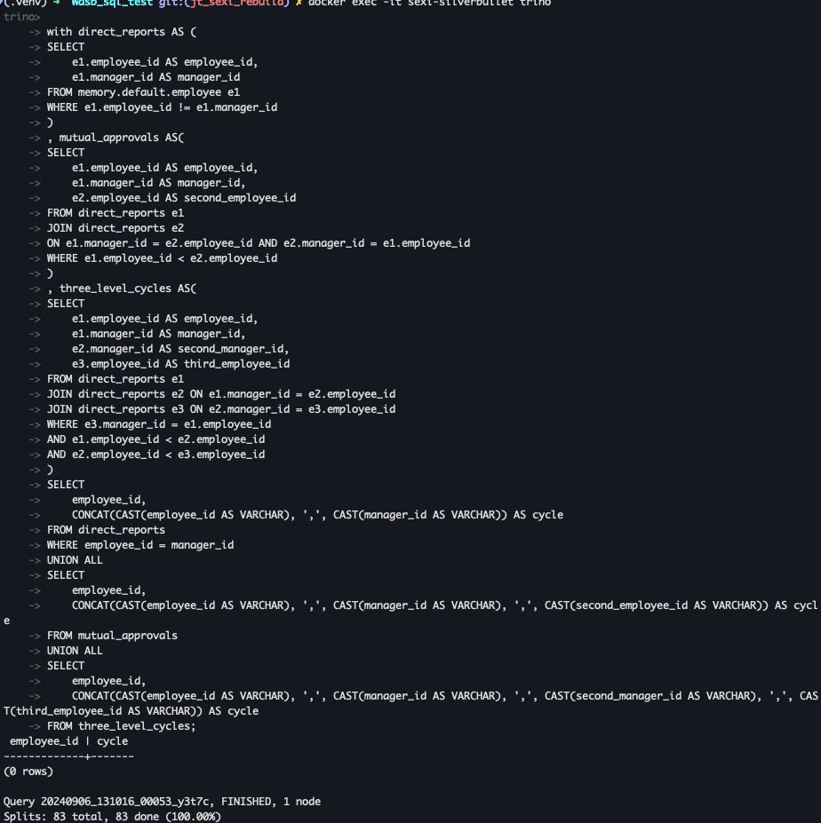
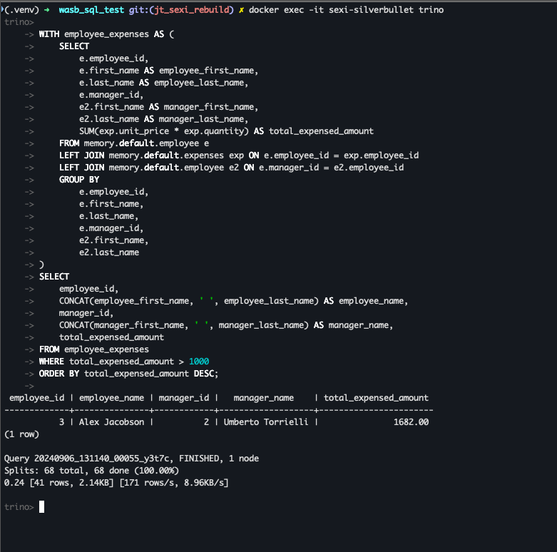
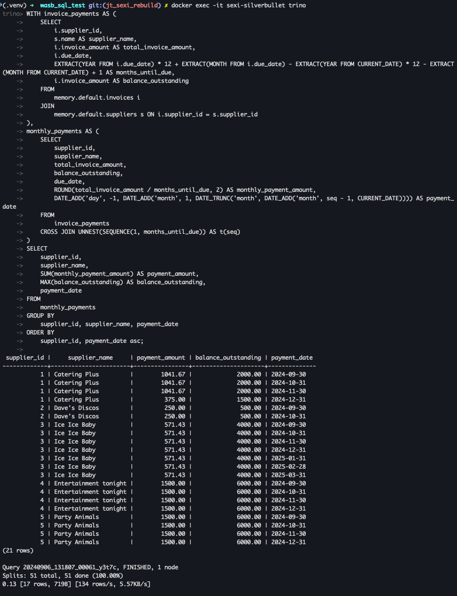

# SExI rebuild excercise

For rebuilding the system I have used combination of python and sql. Python is mainly used for data ingestion and processing. SQL is used for analytical queries.

Hence I have moved the create scripts to a new folder for ease of use `sql_scripts`. This is where all the create files are, you can take them individually and execute. Please do remember since these create scripts are called within the python module I have purposefully exculeded EOF terminator `;`. If you are running it individually please add them as you execute.

Before executing the logic within the main ensure you have a virtual environment setup
`python3 -m venv .venv`

If you do not have one installed 
`pip install virtualenv`

If no python is available https://www.python.org/downloads/

After virtual environment is setup you can execute 
`pip3 install -r requirements.txt`. This would ensure all packages required to run the main module

The `main.py` contains the logic for 
- creating the tables 
- reading the expense data and inserting it to expense table
- reading the invoice data and inserting it to suppliers and invoices

To execute `python3 main.py`

The main module can be modularized further. As this was time sensitive I have put all in one class. 
Since the functions written are in generic format this can be further split to its own classes and apply unit test logic. 

I have also put a docker-compose file to pull up the trino image. Name for the container is `sexi-silverbullet`. Trino sql shell will be accessible using `docker exec -it sexi-silverbullet trino`

Output of 

1. Find_manager_cycle.sql

2. calculate largest expensor

3. Generate Supplier Payment Plans

